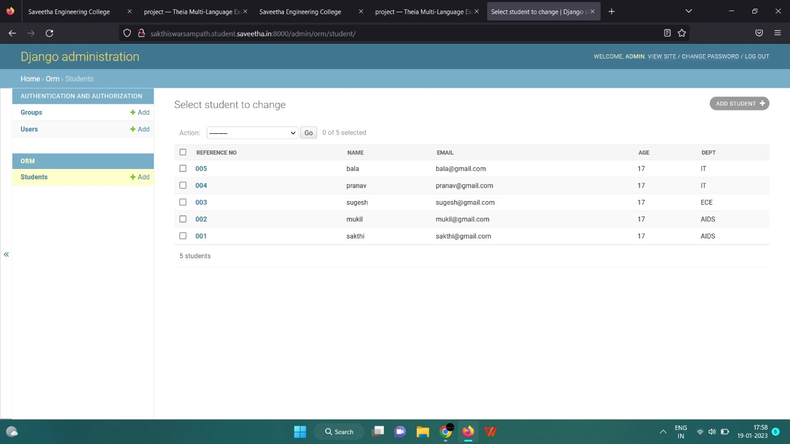

# Django ORM Web Application

## AIM
To develop a Django application to store and retrieve data from a database using Object Relational Mapping(ORM).

## Entity Relationship Diagram

Include your ER diagram here

## DESIGN STEPS

### STEP 1:

### STEP 2:

### STEP 3:

Write your own steps

## PROGRAM
```python
from django.db import models
from django.contrib import admin
# Create your models here.

class student(models.Model):
    reference_no=models.CharField(max_length=75,help_text='Reference_No.')
    name=models.CharField(max_length=100,help_text='Name')
    email=models.EmailField(help_text='Email')
    age=models.IntegerField(help_text='Age')
    Dept=models.CharField(max_length=100,help_text='Class')
class studentAdmin(admin.ModelAdmin):
    list_display=('reference_no','name','email','age','Dept')
```
## OUTPUT




## RESULT
